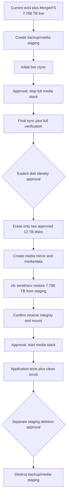

# SER8 Media Storage ZFS Mirror Migration

## Purpose

This document is the implementation handoff for migrating SER8 media storage from two independent ext4 filesystems combined by MergerFS to a two-disk ZFS mirror.
It is written for a fresh implementation session that has no access to the conversation that produced the plan.
The final layout uses only the existing two 12 TB media disks.
The existing four-disk 6 TB RAID-Z2 pool is temporary staging storage and is not part of the final media mirror.

## Required First Action in a Fresh Session

Read `AGENTS.md` and this document completely before inspecting or changing the system.
Run `git status --short` and preserve all unrelated user changes.
Re-query all live state because device names, utilization, service state, and dataset availability can change.
Do not assume that `/dev/sde` and `/dev/sdf` still identify the media disks.
Do not run any command from this document merely because it appears in a code block.

Use this continuation prompt if needed:

```text
Read AGENTS.md and .planning/SER8-ZFS-MIRROR-MIGRATION.md completely.
Continue the SER8 two-disk ZFS mirror migration from the first incomplete step.
Before every numbered execution step, show me the exact commands, resolved targets, expected changes, validation, and rollback, then wait for my explicit approval for that step only.
Never reuse approval from an earlier step.
Before any disk mutation, resolve both approved WWNs and confirm their model, serial, size, filesystem, and mounts.
```

## Approval Contract

Every numbered execution step requires separate user approval before commands run.
Approval for one step does not authorize the next step.
Read-only inspection also requires approval when it is presented as a numbered execution step.
Repository edits require approval for their numbered step.
Live service changes require approval for their numbered step.
Live filesystem or ZFS changes require approval for their numbered step.

Before requesting approval, the implementer must present:

1. The purpose of the step.
2. The exact commands that will run.
3. Every local file and live-system target affected.
4. Whether the step is read-only, repository-writing, live-writing, or destructive.
5. The expected output or state transition.
6. The verification that will follow.
7. The rollback or recovery path.

The implementer must stop after presenting this information and wait for explicit approval.
The implementer must not bundle multiple numbered steps under one approval.

### Additional Disk Approval Gate

Steps that unmount, repartition, erase, format, create a pool, or otherwise mutate either 12 TB disk require a second live identity check immediately before execution.
The implementer must display the complete resolved device information and the complete destructive command again.
The user must explicitly approve those exact targets and commands.

## Goal

The target storage topology is:

```text
/dev/disk/by-id/wwn-0x5000c500b56ea81a ─┐
                                           ├─ ZFS pool: media
/dev/disk/by-id/wwn-0x5000c500b3733a87 ─┘    mirror-0
                                                   │
                                                   └─ media/data
                                                      mountpoint=/mnt/media
```

The target provides approximately 12 TB decimal usable capacity.
It tolerates failure of either one of the two 12 TB disks.
It replaces MergerFS entirely.
It preserves `/mnt/media` as the application-visible path.
It keeps movies, television, books, and music as directories in one ZFS dataset for simplicity (D-22); downloads now live on a separate `rpool/safe/downloads` dataset (D-21), and imports copy from there into the library directories rather than relying on cross-dataset hardlinks, since torrenting is retired.

## Non-Goals

The migration does not add the four 6 TB disks to the final media pool.
The migration does not create a RAID-Z2 media pool.
The migration does not create separate ZFS child datasets for movies, television, and downloads.
The migration does not enable ZFS deduplication.
The migration does not provide an off-host backup.
The migration does not change the system NVMe `rpool`.
The migration does not reformat or reconfigure the existing `backup` pool.

## Safety Rules

Never identify a destructive target only by a kernel name such as `/dev/sde`.
Use the approved `/dev/disk/by-id/wwn-*` paths for every destructive command.
Resolve the WWNs to their current kernel devices immediately before every disk mutation.
Confirm model, serial, size, filesystem, partition table, and mountpoints before every disk mutation.
Refuse to proceed if any identity differs from the approved inventory.
Refuse to proceed if either media disk reports SMART errors, pending sectors, uncorrectable sectors, or a failed extended self-test.
Refuse to proceed if the staging dataset is incomplete or has not passed final verification.
Refuse to proceed if the staging dataset is the only copy and the `backup` pool is degraded.
Never run a whole-host Disko destroy or format command against the complete SER8 Disko configuration.
The complete Disko configuration also contains the system NVMe and four backup disks.
Never run `disko --mode destroy,format,mount` against the full host configuration.
Never use a recursive deletion command against `/mnt/media`, `/mnt/media-staging`, `/mnt/backups`, or a pool mountpoint.
Never remove `backup/media-staging` without a separate approval after final cutover validation.
Never expose SOPS values, API keys, passwords, or decrypted secrets in output.

## Approved Disk Inventory

The following inventory was verified live on 2026-08-13.
It must be verified again before use.

### Media Disk 1

- Approved persistent path: `/dev/disk/by-id/wwn-0x5000c500b56ea81a`
- Kernel path at the prior inspection: `/dev/sde`
- Model: `ST12000NM0117-2GY101`
- Serial: `ZJV4C2NZ`
- Capacity: `12,000,138,625,024` bytes
- Prior filesystem: ext4 on partition 1
- Prior mountpoint: `/mnt/disk1`
- Power-on hours at prior inspection: `9431`
- SMART overall health at prior inspection: passed
- Reallocated sectors at prior inspection: `0`
- Pending sectors at prior inspection: `0`
- Offline uncorrectable sectors at prior inspection: `0`
- UDMA CRC errors at prior inspection: `0`

### Media Disk 2

- Approved persistent path: `/dev/disk/by-id/wwn-0x5000c500b3733a87`
- Kernel path at the prior inspection: `/dev/sdf`
- Model: `ST12000NM0117-2GY101`
- Serial: `ZJV2V0K9`
- Capacity: `12,000,138,625,024` bytes
- Prior filesystem: ext4 on partition 1
- Prior mountpoint: `/mnt/disk2`
- Power-on hours at prior inspection: `9443`
- SMART overall health at prior inspection: passed
- Reallocated sectors at prior inspection: `0`
- Pending sectors at prior inspection: `0`
- Offline uncorrectable sectors at prior inspection: `0`
- UDMA CRC errors at prior inspection: `0`

### Explicitly Protected Devices

The following devices are outside the destructive scope of this migration:

- System NVMe: `/dev/disk/by-id/nvme-CT1000P3PSSD8_24464C21DB62`
- Backup disk: `/dev/disk/by-id/wwn-0x5000c500ea5da96a`
- Backup disk: `/dev/disk/by-id/wwn-0x5000c500e9ec4a9a`
- Backup disk: `/dev/disk/by-id/wwn-0x5000c500e9ec48bb`
- Backup disk: `/dev/disk/by-id/wwn-0x5000c500e9ec29cf`

No destructive command may target a device in this protected list.

## Verified State at Handoff

The values in this section are a snapshot and must not replace fresh inspection.

### Media Storage

- Current layout: two independent ext4 filesystems combined by MergerFS
- Current mount: `/mnt/media`
- Filesystem size after duplicate cleanup: `23,808,755,695,616` bytes
- Used after duplicate cleanup: `7,788,285,710,336` bytes
- Available after duplicate cleanup: `14,820,422,782,976` bytes
- Reported utilization after duplicate cleanup: `35%`
- Movie count: `44` regular files
- Movie apparent size: `1,803,468,450,111` bytes
- Current redundancy: none

### Completed Duplicate Cleanup

Ten verified download-side movie duplicates were permanently removed.
Their canonical Radarr and Jellyfin copies under `/mnt/media/movies` were verified present afterward.
Seven associated qBittorrent records were removed with `deleteFiles=false` before the duplicate files were deleted.
The cleanup reclaimed `494,638,431,621` bytes, or approximately `494.64 GB` decimal.
No further deletion is authorized by this document.

### Backup and Camera Pool

- Pool name: `backup`
- Topology: four 6 TB disks in one RAID-Z2 vdev
- Health at prior inspection: online
- Recent scrub at prior inspection: repaired `0B` with `0` errors
- General backup dataset: `backup/backups`
- General backup mount: `/mnt/backups`
- General backup data at prior inspection: effectively empty
- Camera dataset tree: approximately `418 GB` and growing
- Current ZFS available space at the latest inspection: approximately `11.07 TB` decimal
- Expected free space after staging `7.788 TB`: approximately `3.28 TB` decimal

Camera usage changes continuously.
Recalculate staging capacity immediately before creating or copying into the staging dataset.

### System Pool

- Pool name: `rpool`
- Device count: one NVMe
- Health at prior inspection: online
- This pool is outside migration scope.

## Verified Application Paths

The Nix configuration imports the SER8 media module and creates `/mnt/media/movies` and `/mnt/media/tv`.
The Nix configuration does not declaratively set the live Jellyfin, Radarr, or Sonarr library roots.
The application APIs were therefore inspected directly.

The verified live roots were:

- Jellyfin Movies: `/mnt/media/movies`
- Jellyfin Shows: `/mnt/media/tv`
- Jellyfin Books: `/mnt/media/books`
- Radarr canonical movie root: `/mnt/media/movies`
- Sonarr canonical series root: `/mnt/media/tv`

Radarr also had three unexpected root folders under `/mnt/media/downloads/usenet/complete/movies`.
Those incorrect roots must be investigated and removed before the storage freeze.
Do not delete their contents merely because the roots are incorrect.

## Known Blockers

### qBittorrent and wgnord Restart Loop

At the latest inspection, `wgnord.service` repeatedly entered activation and restarted its bound `qbittorrent-nox.service` approximately every 20 to 25 seconds.
qBittorrent received clean `SIGTERM` signals and alternated between running and stopped states.
`qbittorrent-nox.service` declares `BindsTo=wgnord.service`.
This behavior must be diagnosed and resolved before the migration freeze.
Do not begin the staging or cutover workflow while the media stack is unstable.

### Radarr Root Folder Drift

Radarr had the correct `/mnt/media/movies` root plus three download-directory roots.
The unexpected roots must be reviewed through the Radarr API and removed without deleting media.
The correct movie root must remain `/mnt/media/movies`.

## Desired ZFS Configuration

The final pool name is `media`.
The final vdev type is a two-disk mirror.
The final dataset is `media/data`.
The final mountpoint is `/mnt/media`.

The intended pool and dataset properties are:

| Scope | Property | Value |
|---|---|---|
| Pool | `ashift` | `12` |
| Pool | topology | one `mirror-0` vdev |
| Root filesystem | `mountpoint` | `none` |
| Root filesystem | `canmount` | `off` |
| Dataset | `mountpoint` | `/mnt/media` |
| Dataset | `compression` | `lz4` |
| Dataset | `recordsize` | `1M` |
| Dataset | `atime` | `off` |
| Dataset | `acltype` | `posixacl` |
| Dataset | `xattr` | `sa` |
| Dataset | `normalization` | `formD` |
| Dataset | `dedup` | `off` |
| Dataset | `com.sun:auto-snapshot` | `false` |

Automatic snapshots are intentionally disabled for the single media dataset because downloads and large media deletions can retain substantial space.
This decision can be revisited separately after measuring churn and available capacity.
Weekly ZFS scrubs should continue to cover the new pool.

Downloads relocate to a separate `rpool/safe/downloads` dataset with a 500G quota (D-21), implemented in this phase's final stage, off the storage-freeze critical path.

## Repository Changes

The implementation should modify only the smallest necessary SER8 storage and validation files.

### `hosts/ser8/disko-config.nix`

Replace the ext4 contents of `media-disk1` and `media-disk2` with ZFS members assigned to pool `media`.
Preserve the two approved WWN device paths exactly.
Add a `media` zpool with `mode = "mirror"`.
Add dataset `data` mounted at `/mnt/media`.
Apply the intended pool and dataset properties.
Do not modify `main`, any `backup-disk*` entry, `rpool`, or `backup` except where formatting requires a harmless structural placement change.

### `hosts/ser8/configuration.nix`

Remove the `fileSystems."/mnt/media"` MergerFS declaration.
Add `media` to `boot.zfs.extraPools` if required by the evaluated configuration.
Remove `mergerfs` and `mergerfs-tools` from `environment.systemPackages` unless another active configuration still needs them.
Keep ZFS monitoring, weekly scrubs, and ZED notifications enabled.

### `hosts/ser8/impermanence.nix`

Keep the existing `/mnt/media` tmpfiles rules unless evaluation shows a conflict with the native ZFS mount.
Do not remove application directory ownership rules.

### `hosts/ser8/samba.nix`

Keep the Samba media share at `/mnt/media`.
No client-visible path change is intended.

### Media Service Configuration

Keep Radarr, Sonarr, Jellyfin, Bazarr, qBittorrent, SABnzbd, and NZBGet paths under `/mnt/media` unchanged.
Do not create separate ZFS datasets for downloads and libraries because hardlinks cannot cross dataset boundaries.

### Smoketests

Extend the SER8 media smoketest to verify all of the following:

- `/mnt/media` is mounted.
- `/mnt/media` is sourced from `media/data`.
- `/mnt/media` uses ZFS rather than `fuse.mergerfs`.
- `zpool status media` is online.
- `zpool status media` contains one mirror vdev with exactly the two approved media disk members.
- The canonical movies, television, books, and download directories exist.
- Media service accounts can access their required directories.
- A controlled import-write test creates a file under the downloads dataset, copies it into a library directory on `media/data`, verifies ownership/permissions, then removes both (D-22).

Do not leave test payloads behind.

## Service Freeze Set

The following live unit names comprise the freeze set (amended post-Phase-12; qBittorrent, wgnord, and nginx are deleted from the fleet):

- `jellyfin.service`
- `radarr.service`
- `sonarr.service`
- `bazarr.service`
- `prowlarr.service`
- `sabnzbd.service`
- `nzbget.service`
- `samba-smbd.service`
- `samba-wsdd.service`
- `media-config.service`
- `servarrs-setup.service`
- `download-clients-setup.service`
- `mealie.service`
- `homebox.service`
- `actual.service`
- `donetick.service`
- `frigate.service`
- `home-assistant.service`
- `mosquitto.service`

Confirm this list again before cutover.

The freeze must stop every process that can write to `/mnt/media`.
Infrastructure stays up throughout the freeze — sshd, networking, Tailscale, the node and zfs Prometheus exporters, and nix-daemon are not part of the stop list.
Quiesce timing moved before the initial staging copy per D-03: there is no separate "keep the media stack running during the first pass" step in this migration; see Stage 2/3 in the Numbered Execution Plan.

## Migration State Machine



## Numbered Execution Plan

Each step below has its own approval gate.
Do not infer approval from the user saying the overall plan looks good.

### Step 0.1: Reconcile Repository and Live State

Mutation class: read-only.

Present the exact inspection commands and request approval.
After approval, inspect Git status, current Nix definitions, deployed system generation, mounts, block devices, pools, datasets, utilization, service states, and application roots.
Compare the results with this handoff and update the working notes for any drift.

Exit criteria:

- The active import chain is confirmed.
- Both approved media WWNs resolve to the expected model and serial.
- Protected devices are identified.
- Current media size fits in current staging availability with a meaningful margin.
- No unexplained mount or pool exists.

### Step 0.2: Resolve the wgnord and qBittorrent Restart Loop

Status: Satisfied by Phase 12 — trusted via evidence records per D-05, no live re-verification in this phase. See `.planning/phases/12-fleet-repair/12-CONTEXT.md` and its `evidence/` directory.

Mutation class: begin read-only, then repository-writing or live-writing only through separately approved substeps.

Present the diagnostic commands and request approval.
Determine why `wgnord.service` repeatedly activates and stops.
Reproduce the behavior and identify the controlling unit, timer, script, or failure.
Implement and validate a durable Nix fix before continuing.
Do not treat manually stopping the loop as a permanent fix.

Exit criteria:

- `wgnord.service` remains in its intended stable state.
- `qbittorrent-nox.service` remains active without repeated `SIGTERM` events.
- The qBittorrent API is consistently reachable in the network namespace.
- Relevant validation and smoketests pass without warnings.

### Step 0.3: Correct Radarr Root Folders

Status: Satisfied by Phase 12 — trusted via evidence records per D-05, no live re-verification in this phase. See `.planning/phases/12-fleet-repair/12-CONTEXT.md` and its `evidence/` directory.

Mutation class: live application configuration.

Present the Radarr API reads and proposed root-folder deletions before requesting approval.
Keep `/mnt/media/movies` as the canonical root.
Remove only the confirmed erroneous root-folder records.
Do not delete files or directories as part of removing root-folder records.

Exit criteria:

- Radarr reports `/mnt/media/movies` as its only intended movie root.
- Every registered movie path remains under `/mnt/media/movies`.
- Jellyfin and Radarr still see the canonical movie files.

### Step 0.4: Run the Short SMART Health Test Gate (D-04)

Mutation class: live device diagnostic.

Present the exact `smartctl` commands and both resolved devices before requesting approval.
Run `smartctl -a` on both approved WWNs and confirm `SMART overall-health self-assessment test result: PASSED`, and that the Reallocated_Sector_Ct, Current_Pending_Sector, and Offline_Uncorrectable raw values are all zero on both disks.
Then run `smartctl -t short` on each disk, sequentially rather than concurrently, per the enclosure/controller thermal-safety note.
Wait approximately two minutes per disk for the short self-test to complete.
Re-read `smartctl -a` on each disk afterward and confirm `Self-test execution status: ... completed without error`.
Refuse to proceed to Step 4.3 (erase) if any counter is nonzero or either short test fails; never rationalize a nonzero counter as acceptable.

Exit criteria:

- Both short self-tests complete without error.
- Reallocated sectors remain zero.
- Pending sectors remain zero.
- Offline uncorrectable sectors remain zero.
- SMART overall health remains passed.

### Step 0.5: Create Source Inventory

Mutation class: read-only except for writing task-owned manifest files.

Present the manifest destination and commands before requesting approval.
Record null-safe path, type, size, ownership, permissions, modification time, inode metadata, and extended attributes for `/mnt/media`.
Record total regular-file count and apparent byte total.
Store the manifest outside `/mnt/media` and outside the temporary staging dataset.
Do not store secrets or application credentials.

Exit criteria:

- The manifest is complete and readable.
- The byte total reconciles with the live filesystem.
- The manifest location survives the media outage.

### Step 1.1: Implement the Nix Storage Definition

Mutation class: repository-writing only.

Present the intended file diff and request approval.
Create a feature branch if the current branch is shared or protected.
Implement the repository changes described above.
Do not activate the new generation because the `media` pool does not exist yet.

Exit criteria:

- The diff changes only intended SER8 storage and validation files.
- The two approved media WWNs are unchanged.
- No protected disk declaration changed.
- MergerFS is absent from the evaluated final media mount.
- The evaluated ZFS topology is a two-disk mirror.

### Step 1.2: Validate the Repository Change Without Activation

Mutation class: build and evaluation only.

Present the exact validation commands and request approval.
Run formatting, focused evaluation, focused SER8 build validation, static analysis, and relevant smoketest syntax checks.
Run broader checks when practical.
Do not run `make test-ser8`, `make switch-ser8`, or any command that activates the new mount definition.

Expected validation includes:

```bash
make fmt
statix check
make build-ser8
```

Use the repository development shell as required.
Treat every warning as a failure.

Exit criteria:

- Formatting is clean.
- Static analysis is clean.
- SER8 evaluates and builds.
- No live generation changed.

### Step 2.1: Recheck Staging Capacity and Pool Health

Mutation class: read-only.

Present the exact ZFS and filesystem queries and request approval.
Recalculate current `/mnt/media` used bytes and `backup` pool available bytes.
Confirm the backup pool is online and its latest scrub has no errors.
Confirm camera quotas and growth leave adequate margin during the copy.

Exit criteria:

- The complete media tree fits in the backup pool.
- At least the agreed safety margin remains after staging.
- The backup pool is online with no data errors.

### Step 2.2: Create `backup/media-staging`

Mutation class: live ZFS write, reversible.

Present the exact `zfs create` command and properties before requesting approval.
The intended command shape is:

```bash
sudo zfs create \
  -o mountpoint=/mnt/media-staging \
  -o compression=lz4 \
  -o recordsize=1M \
  -o atime=off \
  -o dedup=off \
  -o com.sun:auto-snapshot=false \
  backup/media-staging
```

Recheck that the dataset does not already exist before presenting the command.
Do not add a reservation that could starve camera datasets.

Exit criteria:

- `backup/media-staging` exists.
- It mounts at `/mnt/media-staging`.
- All intended properties are local or inherited as expected.
- The backup pool remains online.

Rollback before data copy:

- Unmount and destroy only the empty `backup/media-staging` dataset after separate approval.

### Step 2.3: Run the Initial Live Copy

Mutation class: live data copy to staging.

Present the exact `rsync` command and request approval.
Keep the media stack running during this first pass.
Use options that preserve ownership, permissions, ACLs, extended attributes, hardlinks, sparse files, and timestamps.
Keep the copy on one source filesystem boundary.

The intended command shape is:

```bash
sudo rsync -aHAXx --numeric-ids --info=progress2 \
  /mnt/media/ /mnt/media-staging/
```

Do not use `--delete` on the initial pass.
Capture the command exit status and complete log.

Exit criteria:

- The copy exits successfully.
- No I/O errors occur.
- Source services remain healthy.
- The destination file count and bytes are plausible.

### Step 2.4: Validate the Initial Copy

Mutation class: read-only.

Present the validation commands and request approval.
Compare counts, byte totals, ownership, modes, ACLs, and extended attributes.
Run an rsync dry run without deletion to identify drift while services remain live.
Drift caused by ongoing writes is expected at this stage and must be documented.

Exit criteria:

- No structural copy failure is present.
- Remaining differences are consistent with live writes.
- Staging capacity remains safe.

### Step 3.1: Stop the Full Media Stack

Mutation class: live service outage.

Present the exact `systemctl stop` command and ordered unit list before requesting approval.
Include `wgnord.service` as needed to keep qBittorrent from restarting.
Stop every writer to `/mnt/media`.
Stop Samba before declaring the source frozen.
Optionally stop nginx if its qBittorrent proxy would otherwise present a misleading interface.

After stopping, verify every unit individually and confirm no process has an open writable handle under `/mnt/media`.
Do not proceed if any writer remains active.

Exit criteria:

- All approved media-stack units are stopped.
- qBittorrent stays stopped.
- Samba no longer accepts writes.
- No process has a writable open file under `/mnt/media`.
- `/mnt/media` remains mounted for the final sync.

Rollback:

- Restart the original stack against the unchanged MergerFS mount.

### Step 3.2: Run the Final Frozen Synchronization

Mutation class: live data synchronization to staging.

Present the exact `rsync` command and request approval.
Use `--delete` only after confirming source and destination paths character by character.
The source must be `/mnt/media/`.
The destination must be `/mnt/media-staging/`.

The intended command shape is:

```bash
sudo rsync -aHAXx --numeric-ids --delete --info=progress2 \
  /mnt/media/ /mnt/media-staging/
```

Exit criteria:

- The final sync exits successfully.
- No I/O errors occur.
- The media stack remains stopped.

### Step 3.3: Perform Full Staging Verification

Mutation class: read-only but potentially long-running.

Present the exact verification commands and expected duration before requesting approval.
Compare the frozen source manifest with staging.
Run a checksum-based rsync dry run with deletion reporting enabled.
The intended command shape is:

```bash
sudo rsync -aHAXxnc --numeric-ids --delete --itemize-changes \
  /mnt/media/ /mnt/media-staging/
```

Treat any output as a discrepancy that must be understood.
Verification uses deterministic per-file sampling per D-07/D-09: head plus tail plus 1 MiB per GiB of file size, with offsets derived from the file size, and files under 1 MiB hashed fully.
Pair the sampled hash comparison with a 100%-coverage metadata-only dry run.
The gate is "itemized/diff output is empty," enforced by the verification script — never by rsync's exit status, since rsync exits `0` even when differences are found.
Do not erase either media disk until this step produces zero unexplained differences.

Exit criteria:

- File counts match.
- Apparent bytes match.
- Metadata verification passes.
- Checksum verification reports zero differences.
- `backup` remains online with no errors.

### Step 4.1: Reconfirm Destructive Targets

Mutation class: read-only identity gate.

Present the exact identity commands and request approval.
Resolve both approved WWNs.
Display `lsblk`, `readlink`, `udevadm`, `smartctl`, `findmnt`, filesystem signatures, and partition tables.
Display the protected devices in the same approval message.
Display the exact destructive commands planned for the next step, but do not run them.

The approved identity tuple must be exact:

```text
wwn-0x5000c500b56ea81a
ST12000NM0117-2GY101
ZJV4C2NZ
12,000,138,625,024 bytes

wwn-0x5000c500b3733a87
ST12000NM0117-2GY101
ZJV2V0K9
12,000,138,625,024 bytes
```

Exit criteria:

- Both tuples match exactly.
- Both current ext4 mount sources are accounted for.
- No protected device appears in a destructive command.
- The user explicitly confirms the displayed targets.

### Step 4.2: Unmount MergerFS and Both ext4 Members

Mutation class: live mount change.

Present the exact unmount commands and mount targets before requesting approval.
Confirm the media stack is still stopped.
Unmount `/mnt/media` first, then `/mnt/disk1` and `/mnt/disk2`.
Verify that none of the three paths remains mounted.
Do not erase anything in this step.

Rollback:

- Remount both ext4 members and MergerFS, then restart the original media stack.

### Step 4.3: Erase and Partition Only the Approved Media Disks

Mutation class: destructive and irreversible for the original ext4 filesystems.

Present the exact commands, complete WWN paths, resolved identities, expected partition layout, and protected-device list again.
Wait for explicit approval for this step even if Step 4.1 was approved.
Use persistent WWN paths in the commands.
Do not use the prior `/dev/sde` or `/dev/sdf` names.
Do not run whole-host Disko formatting.

After execution, verify that only the two approved disks changed.
Verify that each disk has the intended GPT and one ZFS partition.

Rollback after this point:

- The original ext4 filesystems are gone.
- The verified `backup/media-staging` dataset is the recovery source.
- If cutover must pause, staging can be temporarily mounted at `/mnt/media` after a separately approved mountpoint change.

### Step 4.4: Create and Verify the Empty `media` Mirror

Mutation class: live ZFS pool creation.

Present the exact `zpool create` and `zfs create` commands before requesting approval.
Use only the two approved WWN partition paths.
Create one mirror vdev rather than a stripe.
Create `media/data` with the intended properties and mountpoint.

Do not continue until `zpool status media` shows exactly:

- One pool named `media`.
- One `mirror-0` vdev.
- Exactly two members.
- Both members online.
- Both members resolve to the approved WWNs.

Confirm `/mnt/media` is sourced from `media/data` and uses ZFS.

### Step 4.5: Activate the Matching Nix Generation

Mutation class: live NixOS activation.

Present the exact activation command and built generation before requesting approval.
Use `make test-ser8` before a boot-persistent switch when practical.
Verify the temporary activation before presenting `make switch-ser8` as its own separately approved step.
Do not bypass confirmation with `NO_CONFIRM=true` unless the user explicitly requests non-interactive activation.

Exit criteria:

- The evaluated and live mount configuration agree.
- MergerFS is not active.
- `media/data` mounts at `/mnt/media` after activation.
- The empty mirror remains online.

### Step 5.1: Restore Staging into the New Mirror

Mutation class: live data copy to the final pool.

Present the exact restore commands and request approval.
Keep the media stack stopped.
Send the verified staging dataset into `media/data` via `zfs send`/`zfs recv` (D-08) rather than a file-level copy.

The intended command shape is:

```bash
sudo zfs snapshot backup/media-staging@verified
sudo zfs send -s backup/media-staging@verified | sudo zfs recv -u media/data
sudo zfs set mountpoint=/mnt/media media/data
sudo zfs mount media/data
```

Exit criteria:

- `zfs recv` exits successfully with no stream errors.
- No pool or device errors occur.
- The media stack remains stopped.

### Step 5.2: Confirm Restore Integrity and Mount

Mutation class: read-only.

Present the exact verification commands and request approval.
Verify the `zfs recv` from Step 5.1 exited `0` with no stream errors.
Verify `zfs get mountpoint,mounted media/data` shows `mountpoint=/mnt/media` and `mounted=yes`.
Verify `mount | grep /mnt/media` shows a ZFS filesystem, not `fuse.mergerfs` or ext4.

Full content verification is now intrinsic to the block-checksummed `zfs send`/`recv` stream (D-08); this step does not perform a second full file-by-file comparison.
The first clean scrub (Step 5.5) is the remaining integrity gate, not a second full comparison.

Exit criteria:

- `zfs recv` exit status and stream logs show no errors.
- `media/data` mount and mountpoint match the expected values.
- `zpool status media` remains online.

### Step 5.3: Start the Full Media Stack

Mutation class: live service restoration.

Present the exact ordered `systemctl start` command and unit list before requesting approval.
Start the network namespace dependencies before qBittorrent.
Start Samba only after `/mnt/media` is verified mounted from `media/data`.
Confirm every unit individually after startup.

Exit criteria:

- Every intended service is active.
- qBittorrent remains stable.
- No service writes outside `/mnt/media` because of a missing mount.
- Samba serves the new ZFS-backed path.

### Step 5.4: Run Application and Storage Tests

Mutation class: live validation with controlled writes.

Present every test and any controlled test payload before requesting approval.
Run repository smoketests and manual end-to-end checks.

Required checks include:

- Jellyfin lists and plays representative movies and episodes.
- Radarr sees its canonical movie root and registered files.
- Sonarr sees its canonical series root and registered files.
- Bazarr can access media paths.
- Samba clients can list and read the share.
- A controlled Samba write and deletion succeeds.
- qBittorrent can create a controlled test download path.
- A controlled hardlink across download and library directories succeeds within `media/data`.
- `findmnt` reports ZFS for `/mnt/media`.
- ZFS exporter exposes the `media` pool.
- ZED configuration covers the new pool.
- `zpool status media` remains clean.

Remove all controlled test payloads after verification.

### Step 5.5: Run the First Media Pool Scrub

Mutation class: live ZFS maintenance.

Present the exact scrub command and request approval.
Start a scrub of `media` and monitor it to completion.
Do not remove staging while the scrub is running.

Exit criteria:

- The scrub completes.
- It repairs `0B` unless a fully explained condition exists.
- It reports zero data errors.
- Both mirror members remain online.

### Step 6.1: Observe the Cutover

Mutation class: read-only monitoring.

Present the observation window and checks before requesting approval.
Keep `backup/media-staging` intact during the agreed observation period.
Monitor service logs, pool health, capacity, mount stability, and application behavior.
Do not count the staging dataset as a permanent backup because it resides in the same host.

Exit criteria:

- No unexplained service or storage errors occur.
- Media applications operate normally.
- The mirror remains online.
- The user accepts the cutover.

### Step 6.2: Remove Temporary Staging

Mutation class: destructive ZFS dataset deletion.

Present the exact dataset name, used bytes, destroy command, final mirror status, last scrub result, and application validation results before requesting approval.
The only intended target is `backup/media-staging`.
Wait for explicit approval immediately before destruction.
Do not recursively delete files through the mountpoint.
Destroy the dataset through ZFS only after approval.

Exit criteria:

- `backup/media-staging` no longer exists.
- `/mnt/media-staging` is not mounted.
- Capacity returns to the backup pool.
- Camera datasets remain unchanged and healthy.
- The `media` mirror remains the live media source.

## Rollback Matrix

| Point | Authoritative copy | Rollback action |
|---|---|---|
| Before Step 3.1 | Original ext4 plus MergerFS | Continue normal operation |
| After initial staging copy | Original ext4 plus MergerFS | Destroy staging only after separate approval |
| After service freeze but before erase | Original ext4 plus verified staging | Remount or keep MergerFS and restart services |
| After ext4 erase | `backup/media-staging` | Temporarily mount staging at `/mnt/media` or retry mirror creation |
| During restore | `backup/media-staging` | Destroy and recreate only the new `media` pool after approval |
| After restore verification | New mirror plus staging | Return services to staging or repair the mirror |
| After staging deletion | New mirror only | Restore from whatever external backups exist |

## Capacity Expectations

The final mirror has 24 TB raw disk capacity and approximately 12 TB decimal usable capacity before ZFS overhead and reserved space.
With `7.788 TB` of current media, nominal utilization is approximately `65%`.
Actual reported availability will be lower than the nominal calculation because of ZFS metadata and slop space.
The implementation should record the actual `zpool list`, `zfs list`, and `df` results after restore.
The pool should retain reasonable free space for performance, copy-on-write behavior, and future growth.

## Completion Criteria

The migration is complete only when all of the following are true:

- The repository defines two approved 12 TB disks as a ZFS mirror.
- MergerFS is removed from the active configuration.
- `/mnt/media` is mounted from `media/data`.
- `zpool status media` reports one online mirror with the two approved members.
- Every required media service is stable and active.
- Jellyfin playback succeeds.
- Radarr and Sonarr roots are correct.
- Samba access succeeds.
- Controlled download and hardlink behavior succeeds.
- Full restore verification reports zero differences.
- The first scrub completes with zero data errors.
- Relevant builds, linters, and smoketests pass without warnings.
- The user separately approves staging deletion.
- `backup/media-staging` is removed only after that approval.
- Final capacity and health are documented.

## Handoff Status

Status at document creation:

- Duplicate cleanup: complete
- Canonical movie verification: complete
- Torrent record cleanup: complete
- Repository migration changes: not started
- Staging dataset: not created
- Initial staging copy: not started
- Media stack freeze: not started
- Media disk reformat: not started
- ZFS media pool: not created
- Restore: not started
- Cutover: not started
- Staging deletion: not started
- qBittorrent and wgnord blocker: resolved — Phase 12 deleted the stack (`.planning/phases/12-fleet-repair/`)
- Radarr root-folder cleanup: resolved — Phase 12 API cleanup (`.planning/phases/12-fleet-repair/`)

Phase 13 execution is now underway per `.planning/phases/13-zfs-mirror-migration/`.

The next action is Step 0.1.
The fresh implementer must present the Step 0.1 inspection commands and wait for explicit approval before running them.
