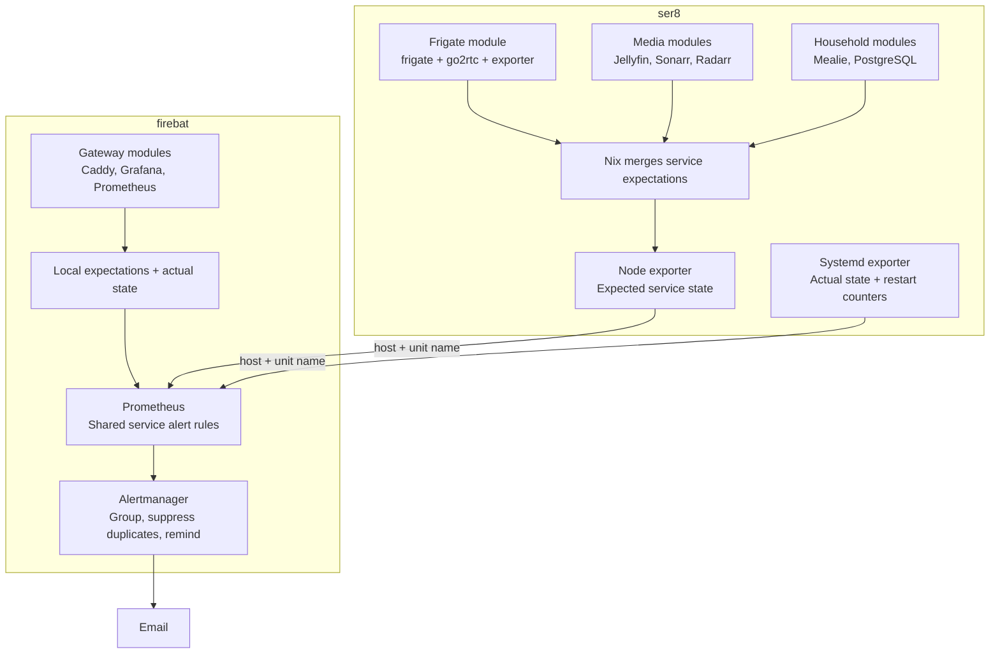
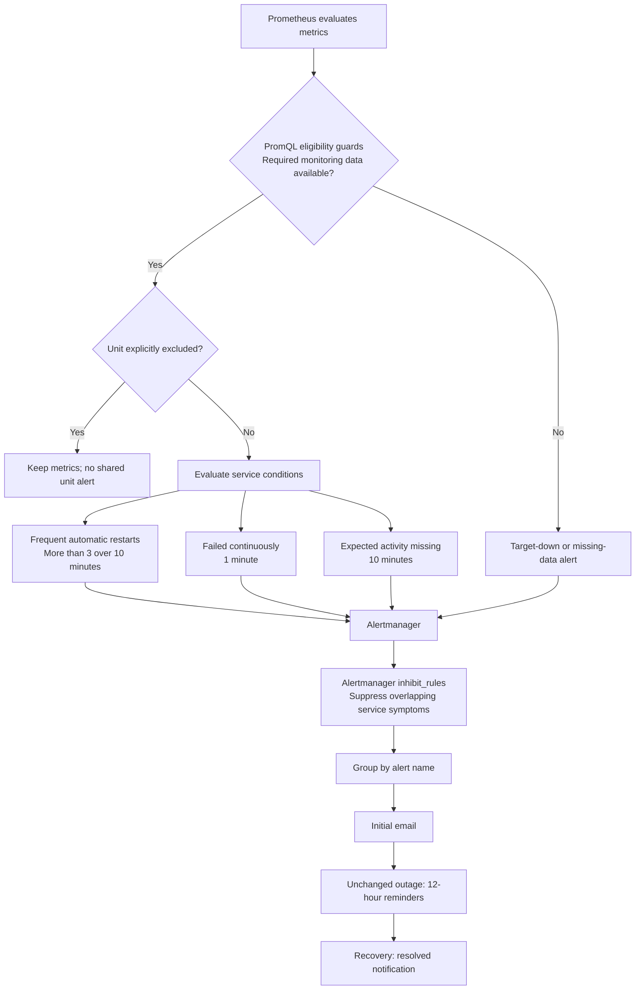

# Composable service monitoring

Status: implemented in configuration (2026-09-19); deployment to hosts pending.

## Implementation map

- Option schema and validation: `modules/common/service-monitoring.nix`.
- Policy publication, textfile-directory ownership, broadened systemd collection: `modules/servers/service-monitoring.nix`.
- Host inventory and per-target `host` labels: `modules/gateway/monitored-hosts.nix`, `modules/gateway/prometheus.nix`.
- Shared rule artifact (production and checks consume one derivation): `modules/gateway/service-alert-rules.nix`.
- Alertmanager inhibition: `modules/gateway/alertmanager.nix`.
- Expectations: declared beside each owning service module on ser8 and firebat.
- Checks: `checks.{x86_64-linux,aarch64-darwin}.service-alert-rules` (promtool check + test over `tests/service-alert-tests.yml`), `service-monitoring-eval` (`tests/service-monitoring-eval.nix`), and `checks.x86_64-linux.service-monitoring-vm` (`tests/service-monitoring-vm.nix`).
- Deployed smoketests: `scripts/smoketests/gateway/test-service-monitoring.sh`, `scripts/smoketests/ser8/test-service-monitoring.sh`.

Not implemented from the test matrix: an isolated-receiver Alertmanager inhibition behavior test.
The inhibition configuration is validated syntactically by the module's build-time amtool check only; `promtool test rules` does not and cannot cover notification behavior.
The generation-switch policy-removal case is covered at evaluation level (the policy file derives wholly from the current generation's declarations) rather than by a VM switch test.

Deployment order: deploy ser8 before firebat.
Until ser8 publishes its policy file, firebat's new rules would raise `SystemdMonitoringDataMissing` (policy family) for ser8 after ten minutes.
Restart counters start empty, so the crash-loop rule cannot misfire on fresh history.
After both deployments, run the gateway and ser8 smoketests and compare scrape duration and sample counts against the pre-rollout baseline.

Each service declares its expectations locally; the shared monitoring module handles collection and alerts.

## Scope and non-goals

This proposal covers systemd unit failures, automatic restart loops, and unexpected inactivity of services declared continuously required.
It also covers loss of the monitoring data needed to evaluate those expectations.

Application-level health is outside this proposal.
A healthy systemd unit does not prove that a camera delivers frames, a detector subprocess works, recordings are written, or an HTTP application responds correctly.
The front-door camera outage would not have triggered these service rules while Frigate and go2rtc remained healthy.
The separate [Frigate camera alerting and State timeline todo](todos/pending/2026-09-18-frigate-camera-down-alerting-and-status-panel.md) covers camera FPS, detector stalls, and recording quota pressure.
Existing blackbox rules retain responsibility for HTTP availability.
Completing this proposal does not complete those application-health requirements.

## Architecture



Host-local expectations avoid making firebat evaluate every other host's Nix configuration.
Adding a service expectation requires deploying only that service's host.

## Service configuration examples

The following snippets illustrate the proposed interface.
They are not existing options in the repository.

### Frigate

Declare expectations beside the existing Frigate configuration:

```nix
# modules/automation/frigate.nix
homelab.monitoring.systemd.units =
  lib.mkIf config.services.frigate.enable {
    "frigate.service".expectedRunning = true;
    "go2rtc.service".expectedRunning = true;
    "frigate-exporter.service".expectedRunning = true;
  };
```

### Caddy

```nix
# modules/gateway/caddy.nix
homelab.monitoring.systemd.units =
  lib.mkIf config.services.caddy.enable {
    "caddy.service".expectedRunning = true;
  };
```

### Mealie

```nix
# hosts/ser8/household/mealie.nix
homelab.monitoring.systemd.units =
  lib.mkIf config.services.mealie.enable {
    "mealie.service".expectedRunning = true;
  };
```

These declarations merge automatically.
Disabling the corresponding service removes its expectation on the next deployment.

### Scheduled jobs

`backup-verify.service` should finish and become inactive, so it normally needs no monitoring declaration.
Its existing service and timer configuration remain unchanged.

| Observed behavior | Without `expectedRunning` | With `expectedRunning = true` |
|---|---|---|
| Active | Quiet | Quiet |
| Successfully exits | Quiet | Alerts after 10 minutes |
| Enters failed state | Alerts after 1 minute | Alerts after 1 minute |
| Repeated automatic restarts | Crash-loop alert | Crash-loop alert |
| Disappears from unit metrics | No unit-specific expectation | Missing-activity alert |
| Exporter becomes unavailable | Collection/target alert | Collection/target alert |

Existing backup `OnFailure` email remains an independent notification path.
A failed backup unit can therefore also receive grouped reminders from shared monitoring.

### Explicit exceptions

```nix
homelab.monitoring.systemd.units."example.service".enable = false;
```

This disables shared alerts for that unit, not the service or its metrics.
Use permanent exceptions sparingly and document their rationale beside the declaration.
Use an Alertmanager silence for temporary maintenance.

## Proposed option interface

Define the options in `modules/common/service-monitoring.nix` and import that schema from `modules/common/default.nix`.
Keep policy generation, publication, and exporter wiring in `modules/servers/service-monitoring.nix`, imported by the server module.
Defining an expectation must not itself enable an exporter or publish metrics.

Every current host imports both common and servers through the flake's `baseModules`, so the original placement would not break today's host evaluations.
The separation makes future host composition and isolated module tests safe without requiring collection machinery merely to declare an option.
Service modules and isolated tests still need the common schema in their import closure; `lib.mkIf` is not a substitute for defining the option.

The initial schema would look approximately like this:

```nix
options.homelab.monitoring.systemd.units = lib.mkOption {
  default = {};
  type = lib.types.attrsOf (
    lib.types.submodule {
      options = {
        expectedRunning = lib.mkOption {
          type = lib.types.bool;
          default = false;
          description = "Whether this unit should remain active.";
        };

        enable = lib.mkOption {
          type = lib.types.bool;
          default = true;
          description = "Whether shared service alerts apply to this unit.";
        };
      };
    }
  );
};
```

Validate unit names and contradictory declarations during Nix evaluation.
Do not initially add per-service threshold, severity, or email-routing settings.
Undeclared services still receive general failed-state and crash-loop coverage.

Do not infer continuous-running expectations from `wantedBy`, `Restart`, or unit type.
Home Assistant and PostgreSQL can be dependency-started daemons with empty `wantedBy`, while boot helpers can superficially resemble continuous services.

## Generated policy and metric matching

Nix generates the following file; users do not maintain it manually:

```text
# /etc/node-exporter-static/systemd-policy.prom
homelab_systemd_monitoring_info 1

homelab_systemd_expected_running{name="frigate.service"} 1
homelab_systemd_expected_running{name="go2rtc.service"} 1
homelab_systemd_expected_running{name="frigate-exporter.service"} 1
homelab_systemd_expected_running{name="mealie.service"} 1
```

Explicit exceptions produce an exclusion metric:

```text
homelab_systemd_alert_excluded{name="example.service"} 1
```

Publish the file through `environment.etc` and add `/etc/node-exporter-static` as another node-exporter textfile directory.
Preserve `/persist/var/lib/node-exporter-textfile`, which already contains backup metrics.
The server-side service-monitoring module owns both directory flags in one definition.
Remove the old directory-only `extraFlags = lib.mkDefault [...]` definition from `modules/servers/monitoring.nix` rather than splitting ownership between modules.
Otherwise a normal-priority list definition can discard the existing default and silently stop backup metric collection.

```nix
# modules/servers/service-monitoring.nix
services.prometheus.exporters.node.extraFlags = [
  "--collector.textfile.directory=/persist/var/lib/node-exporter-textfile"
  "--collector.textfile.directory=/etc/node-exporter-static"
];
```

Scope collection wiring to enabled exporters and preserve any unrelated exporter flags.

The policy file belongs to the Nix generation.
Activation replaces the complete file, removing obsolete expectations and exclusions.
No mutable policy writer, periodic job, or persisted policy copy is needed.
Always emit `homelab_systemd_monitoring_info`, including when no services have expectations.
The generated file resolves into the Nix store, whose normalized file mtime is not a freshness signal.
Do not apply age-based `node_textfile_mtime_seconds` alerts to this policy file.
Check successful collection and the policy-info metric instead.

### Prerequisite: add explicit host labels

The current node-exporter and systemd scrape configurations do not attach a `host` label.
Adding it is a required firebat configuration change before the new joins can work.
Use explicit `static_configs.labels.host` values, not a relabel expression derived from the address.
Host identity should remain stable if a hostname or network address changes.

Replace the multi-host static target group in each of the two jobs with individually labelled targets.
For the systemd job:

```nix
static_configs = [
  {
    targets = [ "ser8.local:9558" ];
    labels.host = "ser8";
  }
  {
    targets = [ "firebat.local:9558" ];
    labels.host = "firebat";
  }
];
```

Apply the same `host` values to the node-exporter job, retaining its `:9100` target ports.
Do not enable currently disconnected or unscraped hosts as part of this change.

After that change, Prometheus attaches the stable host identity while scraping.
The following samples illustrate expected and observed state:

```text
# Expected
homelab_systemd_expected_running{host="ser8",name="frigate.service"} 1

# Observed
systemd_unit_state{host="ser8",name="frigate.service",state="active"} 0
```

Join policy and observed state using `(host, name)`.
Preserve existing `instance` labels, including their exporter ports, for existing dashboards and rules.
Keep the node exporter's systemd collector because dashboard queries already consume `node_systemd_*` metrics.

Adding a label creates new time series; historical samples do not acquire `host` retroactively.
Verify existing queries across the transition and populate the new series before enabling dependent alerts.

### Broaden service collection deliberately

Broaden the dedicated systemd exporter to collect service units and enable restart collection:

```nix
extraFlags = [
  "--systemd.collector.unit-include=.+\\.service"
  "--systemd.collector.enable-restart-count"
];
```

The restart metric is `systemd_service_restart_total`.
It counts automatic restart attempts; ordinary manual restarts do not directly add restart events.
Restart collection is currently disabled, so this metric has no history at initial rollout.
Deploy collection before the rules and allow at least one complete ten-minute restart window to populate.

The current include expression is a curated 14-name allowlist.
The review observed approximately 154 loaded service units on ser8 and 96 on firebat, although those counts will change.
Broad collection adds roughly five state series per loaded unit plus restart and other service metrics.
Measure scrape duration, sample counts, and transient-unit churn before and after rollout rather than assuming the existing 30-day/10-GB retention budget is sufficient.

Transient service failures now participate in general failed-state alerting.
Do not introduce a new collection-level exclusion regex preemptively: dropping collection also removes diagnostic visibility and adds a second exclusion mechanism.
Use explicit alert-policy exceptions for known units when justified.
If measured churn or a concrete family of irrelevant transient units warrants collection filtering, evaluate a narrow exclusion separately and test that required units remain visible.

## Scaling with more services

| Change | What to edit | What to deploy |
|---|---|---|
| Add a continuously running service on ser8 | Its service module and expectation | ser8 |
| Add a scheduled job | Its service/timer module | Its host |
| Remove a service | Its enablement/import; conditional expectation disappears | Its host |
| Add another monitored host | Host configuration and Prometheus scrape targets | New host and firebat |
| Change the global crash-loop threshold | Shared alert rules | firebat |

Going from 10 to 100 services adds exported series and local declarations.
It does not require 100 independently maintained alert rules.
New service units receive failed-state and crash-loop coverage automatically through broad collection.
The declaration adds the stronger promise that a particular service should always be running.

Initial expectations should cover continuously required automation, gateway, media, household services, and their exporters.
Verify actual unit names rather than assuming they match Nix option names.
For example, Sonarr's exporter uses `prometheus-exportarr-sonarr-exporter.service`.
Leave timer jobs, boot helpers, and intentionally on-demand services without continuous-running expectations.

## Alert conditions

| Alert | Condition | Delay | Severity |
|---|---|---|---|
| `SystemdUnitFailed` | Unit remains failed | 1 minute | Critical |
| `SystemdServiceCrashLooping` | `increase(systemd_service_restart_total[10m]) > 3` | No additional delay | Critical |
| `SystemdServiceNotActive` | Expected service is inactive, stuck transitioning, or absent from telemetry | 10 minutes | Critical |
| `SystemdMonitoringDataMissing` | Expected scrape series is absent, or a successful scrape lacks policy, state, or restart data | 10 minutes | Warning |

The restart expression is an extrapolated estimate, not an exact event count.
Describe its result as frequent automatic restarts.

Missing unit telemetry does not prove the service is stopped.
Use wording such as “Expected service activity cannot be confirmed.”
An exporter can answer HTTP successfully while failing to collect systemd data, so `up == 1` alone is insufficient proof of complete telemetry.

### Collection eligibility and failure reporting

Use PromQL guards to prevent per-unit alerts from interpreting unavailable collection as service failure.
All shared unit alerts require a healthy systemd scrape and usable policy collection so exclusions can be applied reliably.
The base eligibility checks are:

```promql
(<unit condition>)
and on (host) (up{job="systemd"} == 1)
and on (host) (up{job="node-exporter"} == 1)
and on (host) (homelab_systemd_monitoring_info == 1)
```

This is an illustrative expression shape; `<unit condition>` is not literal deployable PromQL.
Require positive evidence of healthy collection rather than only excluding `up == 0`, because a missing `up` series must also prevent per-unit fan-out.

Apply data-family checks according to the rule being evaluated.
If all service-state metrics disappear, suppress expected-activity evaluation and raise a host-level missing-data alert.
If one expected unit disappears while other state metrics remain, retain the unit-specific missing-activity alert.
Missing restart metrics must raise a collection alert without disabling valid failed-state alerts.
Test partial per-unit restart coverage separately; an aggregate presence check cannot prove complete coverage.

The existing target-down rule handles scrapes reporting `up == 0`.
`SystemdMonitoringDataMissing` handles healthy scrapes missing policy, state, or restart data, as well as missing expected scrape series.
Derive target-specific absence checks from the same configured node/systemd target inventory; do not maintain another host list.
Collection failures must remain visible even when the unit-alert eligibility guards exclude every unit.

## Notification flow



Proposed notification priority when symptoms overlap:

```text
Crash loop > Failed > Expected activity missing
```

Underlying alerts remain inspectable, but less-specific symptoms do not generate additional emails for the same host and unit.
Implement this service-symptom priority with new `inhibit_rules` in `modules/gateway/alertmanager.nix`.
The existing Alertmanager configuration has no inhibition rules.

```nix
inhibit_rules = [
  {
    source_matchers = [ ''alertname="SystemdServiceCrashLooping"'' ];
    target_matchers = [ ''alertname=~"SystemdUnitFailed|SystemdServiceNotActive"'' ];
    equal = [ "host" "name" ];
  }
  {
    source_matchers = [ ''alertname="SystemdUnitFailed"'' ];
    target_matchers = [ ''alertname="SystemdServiceNotActive"'' ];
    equal = [ "host" "name" ];
  }
];
```

Every unit alert must carry nonempty `host` and `name` labels.
The source and target alert names are disjoint, and inhibition must never cross host boundaries.
Inhibition affects notifications, while PromQL eligibility guards handle unavailable telemetry before unit alerts are produced.
This diagram summarizes notification behavior; partial metric loss still needs explicit coverage in the rules and tests.

Keep existing grouping by alert name and twelve-hour reminders.
The repeat interval applies to unchanged outages, not a strict cap on total messages.
New failures and recoveries can generate notifications at the existing group interval.

## Example: Frigate missing-model failure

Frigate's failed model precheck can retry every ten seconds while the unit remains `activating`.
With the observed start-limit settings, this can continue without reaching a sustained failed state.
The automatic-restart counter provides the missing signal.

```mermaid
sequenceDiagram
  participant S as systemd on ser8
  participant E as Systemd exporter
  participant P as Prometheus
  participant A as Alertmanager
  participant U as You

  S->>S: Frigate model precheck fails
  S->>S: Wait 10 seconds; retry
  S->>E: State remains activating; restart counter grows
  E->>P: Export state and automatic restart count
  P->>P: Restart threshold is crossed
  P->>A: SystemdServiceCrashLooping
  A->>A: Group and suppress duplicate symptoms
  A->>U: Frigate is repeatedly restarting

  Note over S,U: After the model problem is repaired

  S->>E: Frigate active; restart counter stops growing
  E->>P: Healthy state and stable counter
  P->>P: Restart-window condition eventually clears
  P->>A: Alert resolved
  A->>U: Recovery notification
```

Recovery from a crash-loop alert is not necessarily immediate.
Recent restarts remain in its ten-minute lookback window until they age out.
Initial notification timing also includes scraping, rule evaluation, and Alertmanager grouping.

An illustrative email:

```text
[FIRING] SystemdServiceCrashLooping

ser8 / frigate.service

Frequent automatic restarts detected over the last 10 minutes.
The service may be retrying a failed startup.

Inspect:
  systemctl status frigate
  journalctl -u frigate --since "15 minutes ago"
```

## Validation and implementation sequence

### Shared rule artifact

The existing Prometheus rules already use `pkgs.writeText` in `modules/gateway/prometheus.nix`.
Give the new service rule group its own generated YAML derivation, with a definition reusable by the production module and test checks.
Add that same derivation to `services.prometheus.ruleFiles` and pass it to the `promtool check rules` and `promtool test rules` flake check.
Do not copy the production PromQL into a second test-only rule definition.
Migrating the existing alert catalog into this artifact is outside this change.

### Test matrix

| Layer | Required cases |
|---|---|
| Nix evaluation | Schema available through common without server collection; declarations merge; disabled services disappear; invalid names and contradictions fail; both textfile directories survive; explicit host labels agree across jobs; existing instance values remain unchanged |
| Prometheus rules | Firing delays and recovery; automatic restarts and counter resets; empty initial history; `up == 0` and absent `up`; missing policy; HTTP-successful collection with absent state/restart data; one missing expected unit; missing and stale samples; exclusions; host isolation |
| Alertmanager inhibition | Crash loop suppresses failed/inactive notifications; failed suppresses inactive; unrelated units and identical names on different hosts are not inhibited; missing identity labels are rejected by coverage checks |
| NixOS VM | Frigate-shaped failed precheck/restart loop and recovery; successful inactive oneshot; failed oneshot; manual stop of expected service; exporter outage; generation switching removes old policy entries; missing/broken policy publication is detected |
| Deployed smoketests | Expected unit and restart coverage; policy-info presence; healthy rule evaluation; preserved backup textfile metrics; scrape sample counts and duration; no accidental targets for disconnected hosts |

Use an isolated receiver for inhibition tests, without a production email transport.
Do not claim `promtool test rules` alone validates Alertmanager notification behavior.
Production smoketests should verify collection and rule coverage without deliberately breaking live services or sending synthetic production emails.

### Ordered rollout

0. Add explicit per-target `host` labels to firebat's node-exporter and systemd scrape jobs, preserving `instance` and existing target selection.
1. Add the common option schema and server-side policy publication, with one owner for both textfile directory flags.
2. Add conditional expectations beside the owning service configurations and broaden systemd collection with restart counting enabled.
3. Deploy labels, policy, and collection before new alerts; verify joins, backup metrics, collection cost, and complete restart coverage, then observe at least ten minutes of new samples.
4. Add the shared rule artifact and Alertmanager inhibition configuration, with passing rule, module, and isolated integration tests.
5. Deploy the new rules on firebat and run read-only coverage checks against the deployed system.

Host-label setup is a prerequisite for every `(host, name)` join, not an assumption about current metrics.

## References

- [Pinned node-exporter textfile collector](https://raw.githubusercontent.com/prometheus/node_exporter/v1.11.1/collector/textfile.go)
- [Pinned systemd-exporter implementation](https://github.com/prometheus-community/systemd_exporter/blob/v0.7.0/systemd/systemd.go)
- [systemd service implementation](https://github.com/systemd/systemd/blob/v260.2/src/core/service.c)
- [Prometheus rule unit testing](https://prometheus.io/docs/prometheus/latest/configuration/unit_testing_rules/)
- [Alertmanager routing configuration](https://prometheus.io/docs/alerting/latest/configuration/#route)
- [Alertmanager inhibition rules](https://prometheus.io/docs/alerting/latest/configuration/#inhibit_rule)
