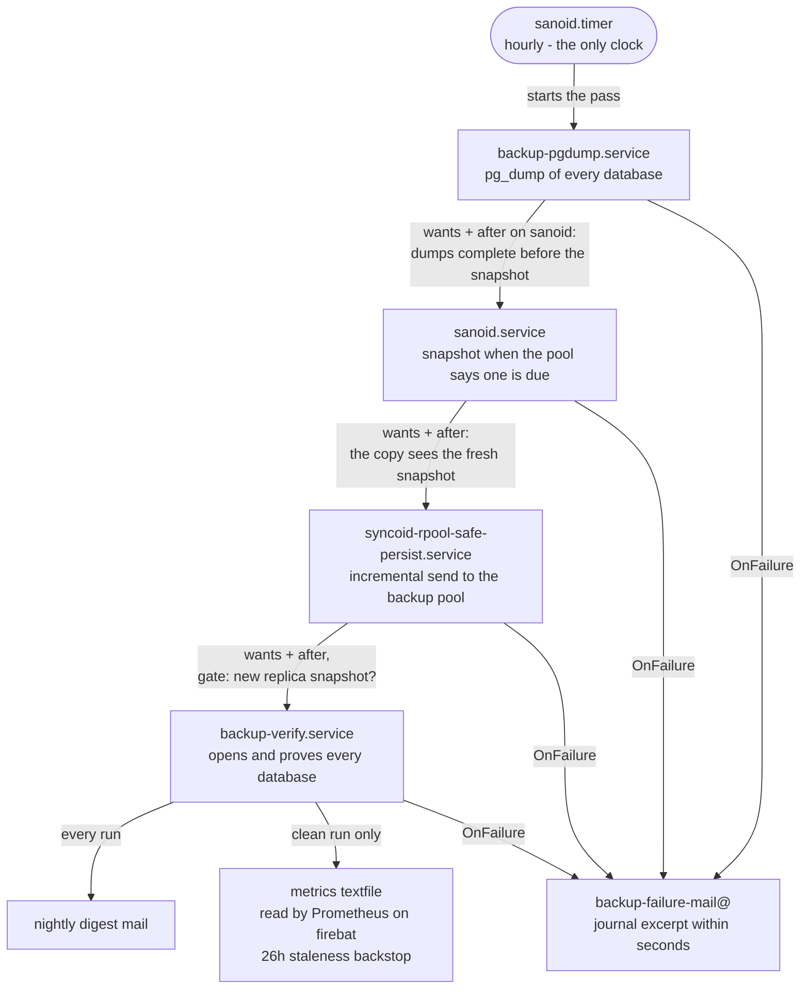

# Backups on ser8

## What runs, and when

One clock drives everything: a timer wakes the snapshot job every hour, and the job asks the pool whether a nightly snapshot exists since the last 10:00 UTC boundary.
Twenty-three passes a day find one and end there.
The pass that does not first runs the PostgreSQL dumps to completion, takes one atomic snapshot of the whole persisted tree, sends it to the `backup` pool, and then verifies it.
Each step is a systemd unit pulled in by the one before it with `wants` plus `after`, and every unit is a oneshot, so "after" is a completion barrier: the snapshot contains finished dumps, the copy sees the snapshot the same pass just took, and the verification reads a replica the copy has already updated.

The verification opens every database inside the new snapshot, proves it recovers, writes a manifest, mails a digest, and places a hold on the snapshot it proved good for each service.
It sits behind a gate that runs it once per new replica snapshot: when the newest daily on the replica already matches the `#replica_snapshot` line of the latest manifest, or the replica holds no snapshot at all, the gate skips the run.
Snapshots are kept for thirty nights on the system disk and ninety on the backup pool.

The nightly hour is 10:00 UTC, which is 03:00 local in summer and an hour earlier in winter.
The hour is UTC because the snapshot tool names its snapshots in UTC; a local-time hour would produce two snapshots with the same name in autumn and a gap in spring.

A machine that was off at the nightly hour heals through the same chain: the first hourly pass after boot finds no nightly since the boundary and takes one, and the copy and the verification follow within minutes.
A catch-up night and a normal night are the same trace at a different hour, so there is no separate catch-up path to reason about.



## Which snapshots exist for a service

```
sudo backup-restore donetick --list
```

```
SNAPSHOT                                CREATED                       USED  VERIFIED
autosnap_2026-08-28_22:00:00_daily      Fri Aug 28 15:00 2026           0B  -
autosnap_2026-08-29_03:00:04_daily      Fri Aug 28 20:00 2026           0B  -
autosnap_2026-08-29_18:00:03_daily      Sat Aug 29 11:00 2026           0B  <- last verified
```

The marked row is the newest snapshot whose contents were opened and proven good.
That is the one a restore uses when you do not name one, and it cannot be pruned while the mark is on it.

Add `--from replica` to list what the backup pool holds instead.
The mark is read from the system disk either way, because holds are not replicated.

To restore from one of the others — when the damage is older than the last verified night, and the marked snapshot already contains it — name it:

```
sudo backup-restore donetick --force --snapshot autosnap_2026-08-29_03:00:04_daily
```

## Restoring a service

```
sudo backup-restore donetick --force
```

Three steps, the same for every service.
It stops the unit, replaces the state directory from the chosen snapshot, and starts the unit again.

What it replaces is moved aside rather than deleted, to a dated directory beside the live one — `/var/lib/donetick.pre-restore-20260829T102300`.
That is a full copy, so a restore that turns out to be the wrong choice can be undone by hand.
Those directories are on the root filesystem, so they are not snapshotted and a reboot clears them; move anything you want to keep.

`--force` is required whenever the live directory is not empty, which during an incident it always is.

To see exactly what a run would do without doing any of it:

```
sudo backup-restore donetick --force --dry-run
```

```
Would restore donetick from rpool/safe/persist/donetick@autosnap_2026-08-29_18:00:03_daily (last verified, from the manifest)
  read from:  source
  unit:       donetick.service (stopped, then started again)
  target:     /var/lib/donetick
  mechanism:  copy, which preserves what it replaces
  move aside: /var/lib/donetick is not empty; its contents would move to /var/lib/donetick.pre-restore-20260829T102254
Nothing was changed.
```

## Restoring a single database

```
sudo backup-restore mealie --force --pg-database mealie
```

This replaces the state directory *and* restores that one database from the portable archive that rode inside the same snapshot.
For an application whose data is split between files and PostgreSQL, both halves have to come from the same night or they will not agree.

The tool does not create a database that is missing.
If the database is gone rather than damaged, recreate it with its correct owner first, then restore:

```
sudo -u postgres psql -c 'create database mealie owner mealie'
```

Do not drop and recreate the `public` schema as the superuser instead.
That leaves a schema the application's own role cannot write to, and the error it then produces on startup — `no schema has been selected to create in` — points nowhere near the cause.

## Restoring when the system disk is the problem

```
sudo backup-restore donetick --force --from replica
```

The replica carries no mountpoint of its own, deliberately, so that a received copy can never mount over a live service directory.
The tool mounts it read-only for the read and puts it back exactly as it found it, so there is no mount incantation to remember at the worst possible moment.

Everything else behaves identically, including resolving the last verified snapshot.

## The destructive alternative

```
sudo backup-restore donetick --force --rollback
```

This is the fast path: instead of copying the snapshot's contents over the live directory, it rewinds the dataset itself.
It destroys every snapshot newer than the one it rewinds to, and it does not preserve the state it replaces.

That is why it is not the default.
On a restore that turns out to be wrong, it has already removed both the evidence and everything you would retry from.

Use it when the dataset is large enough that copying is the problem and you are certain of the target.
It requires `--force` alongside it so it cannot be reached by one flag, and it is refused outright against the replica, because rewinding the receive side diverges it from the source and the next replication would repair that by discarding your rollback.

Preview it first; the preview lists exactly which snapshots would be destroyed.

## The nightly manifest

`/persist/var/lib/backup-manifests/latest.tsv`, with one dated file kept beside it per night.

The header lines describe the run:

```
#snapshot=autosnap_2026-08-29_18:00:03_daily
#snapshot_epoch=1788026403
#replica_snapshot=autosnap_2026-08-29_18:00:03_daily
#replica_epoch=1788026403
#covered=actual bazarr donetick frigate hass homebox jellyfin mealie mosquitto nzbget postgresql prowlarr radarr sabnzbd sonarr tailscale
#duration_seconds=25
#written_bytes=160022528
#usedbysnapshots_bytes=14459633664
#status=ok
```

`status` is the one to read first: `ok` or `fail`.
`written_bytes` is how much the tree changed since the snapshot and `usedbysnapshots_bytes` is how much the retained snapshots are holding, so the two together are a running record of what this host churns.

The body is tab separated: kind, subject, check, result, bytes, and the snapshot that service's hold now sits on.

```
dataset  rpool/safe/persist/actual  contents         ok  139264  autosnap_2026-08-29_18:00:03_daily
sqlite   /persist/.zfs/snapshot/.../group-79349c18.sqlite  integrity_check  ok  16384   -
pgdump   /persist/.zfs/snapshot/.../mealie.dump   pg_restore-list  ok  359665  -
replica  backup/persist-replica@autosnap_2026-08-29_18:00:03_daily  freshness  ok  -  -
```

A `dataset` row whose last field names an older snapshot than the others is the useful signal: that service failed its checks recently, and the snapshot named is the last one that passed — which is exactly the one to restore from.

To see which services are not held at the newest snapshot:

```
sudo awk -F'\t' '$1=="dataset"{print $2, $4, $6}' /persist/var/lib/backup-manifests/latest.tsv
```

## The three alerts

All three fire either when a timestamp stops advancing for twenty-six hours or when the series disappears entirely.
The second arm matters more than the first: a job that never ran publishes nothing, and a rule written only as a threshold would stay quiet forever.

- **BackupSnapshotStale** — no new nightly snapshot. Check `systemctl status sanoid.service` first; the snapshot job also runs the database dumps, so a failed dump can be what you actually find.
- **BackupReplicaStale** — snapshots are being taken but not reaching the backup pool. Check `systemctl status syncoid-rpool-safe-persist.service`, then that the `backup` pool is online and has room.
- **BackupVerifyStale** — snapshots exist but nothing has proven them good. Check `systemctl status backup-verify.service`. This is the one that is silently important: the snapshots look fine and nothing has opened them. A verification skipped by its gate is not a failure of the verifier: it means no new replica snapshot arrived, the cause is upstream in the copy, and BackupReplicaStale will be firing alongside.

A failing job also mails immediately, so the alerts are the slow backstop for a job that stopped running rather than one that ran and failed.

## When the verification fails

The unit names the file it failed on:

```
journalctl -u backup-verify.service -n 50
```

Failures read as either a `PRAGMA integrity_check` that returned something other than `ok`, or a portable archive that would not list.
The manifest holds the same information with the sizes beside it:

```
sudo awk -F'\t' '$4!="ok" && $1!="dataset"' /persist/var/lib/backup-manifests/latest.tsv
```

A database that fails means the copy inside *that* snapshot is damaged.
It does not by itself mean the live database is damaged, and it does not mean earlier snapshots are: the hold for that service stays where it was, on the last snapshot that passed, and `--list` will show you which one that is.

Files whose result reads `not-a-database` are not failures.
Several things on this host are named `*.db` without being databases — a graphics driver's shader cache, the message broker's own format — and they are recorded with the header that was found so that a file which stops being checked is visible rather than absent.
A file that carries a write-ahead log but no database header *is* reported as a failure, because only a database creates that log.

## Worked examples

These are the commands that were actually run when the restore path was exercised, with what was observed.

**A service restored from the backup pool.**

```
sudo backup-restore donetick --force --from replica
```

```
Restored donetick from backup/persist-replica/donetick@autosnap_2026-08-29_03:00:04_daily
Previous state preserved at: /var/lib/donetick.pre-restore-20260829T102300
```

The service came back active and answering on its port with its data intact — seven chores and three users, the same as before.
A file written into the live directory beforehand was gone afterwards and present inside the preserved copy, which is how you can tell the move-aside is a real copy rather than a deletion.
The replica was left unmounted and without a mountpoint, as it was found.

**A service whose data is a tree of files.**

```
sudo backup-restore actual --force
```

The two files under `user-files` came back with the same count, the same total of 43,030 bytes, and the same checksums as the copies inside the snapshot.
The database under `server-files` was present at 69,632 bytes with its budget still registered.

**An application restored whole, database and uploads together.**

```
sudo backup-restore mealie --force --pg-database mealie
```

Run against a throwaway machine holding a copy of this host's snapshot, after deleting the database and emptying the state directory.
The state directory came back identical to the snapshot apart from the application's own log, which grew because the application had started.
Logging in afterwards showed both recipes, and the recipe image served over HTTP was byte-for-byte the file inside the snapshot.

That combination is the point: the database came from the portable archive and the images came from the state directory, and a restore that recovered only one of them would look like it worked.
